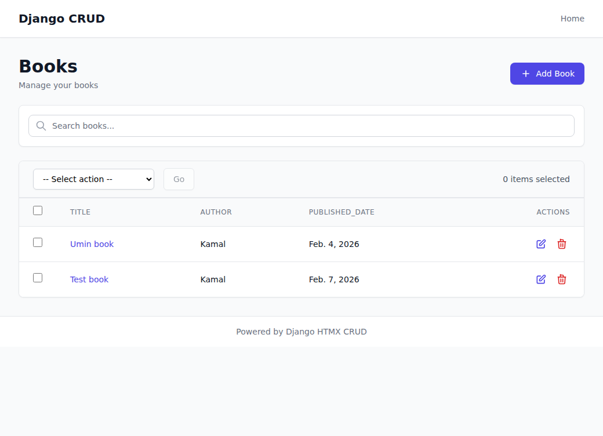
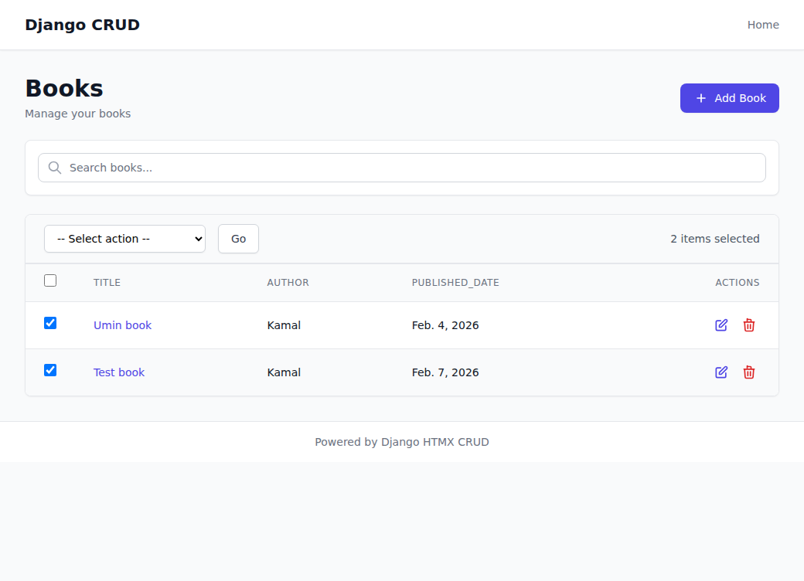

# Bulk Actions Feature Screenshots

## 1. List View with Checkboxes

- Checkbox column added to the left
- "Select all" checkbox in header
- Action dropdown and "Go" button
- Counter showing "0 items selected"

## 2. One Item Selected

- Checkbox checked
- Counter updates to "1 item selected"
- "Go" button becomes enabled

## 3. Two Items Selected

- Multiple items selected
- Counter shows "2 items selected"
- Both checkboxes checked

## 4. Delete Action Selected

- Action dropdown shows "Delete selected items"
- Ready to execute the action

## 5. Beautiful Confirmation Modal

- Clean, modern confirmation dialog
- Warning icon
- Clear title "Delete 2 books?"
- List of items to be deleted
- Cancel and Delete buttons
- Modal appears without page reload (HTMX)
